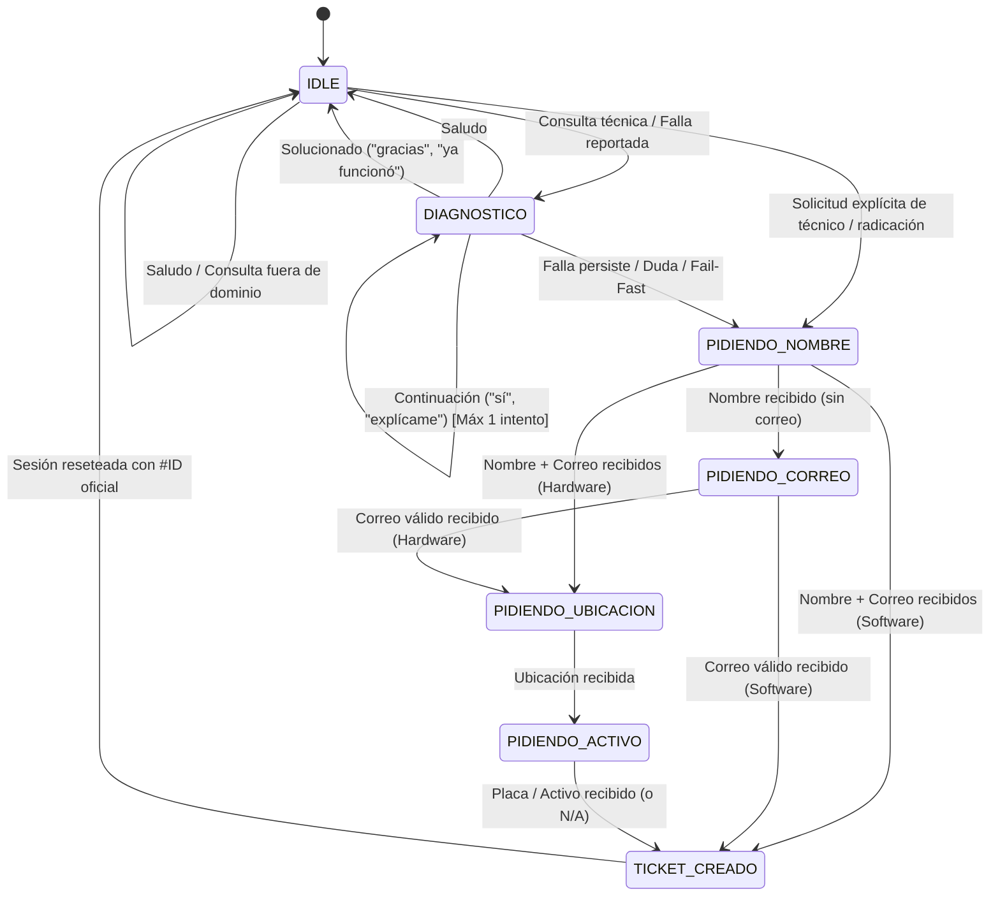

# 🎓 UniMon Backend - Asistente Virtual Inteligente de Soporte Técnico y Gestión de TI
**Universidad Simón Bolívar (Sedes Barranquilla y Cúcuta, Colombia)**

Backend asíncrono de alto rendimiento desarrollado en **FastAPI**, **LangChain**, **ChromaDB**, **Ollama (Llama 3.1:8B)** y **GLPI REST API**. Diseñado con una arquitectura conversacional de Nivel 1 proactiva, orientada a la resolución ágil de incidentes, auto-solución guiada, radicación por *Slot-Filling* adaptativo y guardrails estrictos de dominio institucional.

---

## 📑 Tabla de Contenidos

1. [Arquitectura General del Sistema](#-arquitectura-general-del-sistema)
2. [Principios de Diseño y Lógica de Negocio](#-principios-de-diseño-y-lógica-de-negocio)
3. [Estructura del Proyecto](#-estructura-del-proyecto)
4. [Componentes Técnicos y Módulos](#-componentes-técnicos-y-módulos)
   - [1. Máquina de Estados y Router Conversacional (`router_logic.py`)](#1-máquina-de-estados-y-router-conversacional-router_logicpy)
   - [2. Pipeline RAG y Guardrails (`rag_service.py`)](#2-pipeline-rag-y-guardrails-rag_servicepy)
   - [3. Integración con GLPI REST API (`glpi_service.py`)](#3-integración-con-glpi-rest-api-glpi_servicepy)
   - [4. Ingestión y Vectorización (`ingest_docs.py`)](#4-ingestión-y-vectorización-ingest_docspy)
5. [Máquina de Estados Finita (FSM)](#-máquina-de-estados-finita-fsm)
6. [Instalación y Despliegue](#-instalación-y-despliegue)
7. [Variables de Entorno (`.env`)](#-variables-de-entorno-env)
8. [Especificación de Endpoints API](#-especificación-de-endpoints-api)
9. [Suite de Pruebas Automatizadas](#-suite-de-pruebas-automatizadas)
10. [Procedimientos y Canales Institucionales](#-procedimientos-y-canales-institucionales)

---

## 🏛️ Arquitectura General del Sistema

```
                         ┌─────────────────────────────────────────────────────────┐
                         │                      USUARIO FINAL                      │
                         │             (Web Client / Interfaz UniMon)              │
                         └────────────────────────────┬────────────────────────────┘
                                                      │ HTTP POST /api/chat (session_id, mensaje)
                                                      ▼
                         ┌─────────────────────────────────────────────────────────┐
                         │                   FASTAPI ROUTER LAYER                  │
                         │                   (app/routers/chat.py)                 │
                         └────────────────────────────┬────────────────────────────┘
                                                      │
                                                      ▼
                         ┌─────────────────────────────────────────────────────────┐
                         │                ROUTER LOGIC & FSM ENGINE                │
                         │              (app/services/router_logic.py)             │
                         │                                                         │
                         │  - Buffer de Memoria por Sesión (session_history)       │
                         │  - Regla de 1 Descarte (Fail-Fast)                      │
                         │  - Clasificación Hardware / Software                    │
                         │  - Slot-Filling Adaptativo                              │
                         └───────┬─────────────────────────────────────────┬───────┘
                                 │                                         │
        (Consultas / Diagnóstico)│                                         │(Radicación de Caso)
                                 ▼                                         ▼
   ┌──────────────────────────────────────────────┐       ┌─────────────────────────────────┐
   │             RAG SERVICE ENGINE               │       │        GLPI REST CLIENT         │
   │        (app/services/rag_service.py)         │       │  (app/services/glpi_service.py) │
   ├──────────────────────────────────────────────┤       ├─────────────────────────────────┤
   │ 1. Similarity Search (ChromaDB, k=4)         │       │ 1. initSession (App/User Token) │
   │ 2. Embeddings: multilingual-e5-base          │       │ 2. POST /Ticket                 │
   │ 3. System Prompt Estricto + Historial        │       │ 3. POST /Ticket/{id}/Ticket_User│
   │ 4. Inferencia: Ollama (Llama 3.1:8B)         │       │ 4. killSession (Garantizado)    │
   │ 5. Guardrail Fuera de Dominio                │       └────────────────┬────────────────┘
   └──────────────────────┬───────────────────────┘                        │
                          │                                                │ Radicado Oficial (#ID)
                          └───────────────────────┬────────────────────────┘
                                                  │
                                                  ▼
                         ┌─────────────────────────────────────────────────────────┐
                         │                  RESPUESTA ESTRUCTURADA                 │
                         │        (SALUDO | DIAGNOSTICO | RADICANDO_TICKET |       │
                         │         TICKET_CREADO | SOLUCIONADO | FUERA_DE_DOMINIO) │
                         └─────────────────────────────────────────────────────────┘
```

---

## 🎯 Principios de Diseño y Lógica de Negocio

1. **Regla de 1 Descarte (Fail-Fast):**
   - El asistente ofrece **un único intento** de auto-solución guiada (2 a 3 pasos directos y prácticos).
   - Si el usuario indica que la falla persiste, muestra inconformidad, duda o solicita ayuda técnica, el sistema no insiste en más descartes ni genera bucles: transiciona de inmediato a la toma de datos para radicación.
2. **Cero Fricción Institucional:**
   - La plataforma GLPI opera de manera 100% transparente en el backend.
   - **Prohibición Absoluta:** El chatbot nunca expone la palabra "GLPI", no entrega enlaces a plataformas internas ni instruye a los usuarios a crear tickets manuales. Al usuario se le entrega su número de caso oficial (`#ticket_id`) y se le notifica que el equipo de TI se comunicará a su correo.
3. **Slot-Filling Adaptativo por Categoría:**
   - **Solicitudes de Software, Cuentas y Accesos:** Solicita únicamente **Nombre** y **Correo Institucional**.
   - **Fallas de Hardware y Equipos Físicos:** Solicita **Nombre**, **Correo Institucional**, **Ubicación Física** (Sede, Bloque, Sala/Laboratorio) y **Placa/Activo** del equipo.
4. **Tolerancia a Errores Tipográficos y Variaciones Semánticas:**
   - Interpreta con flexibilidad términos coloquiales o mal escritos (*"proyestor"*, *"katuc"*, *"clabe"*, *"pantaya"*, *"interner"*, *"seben"*, *"no da video"*).
5. **Guardrail Fuera de Dominio (Out-of-Domain):**
   - Rechaza asertiva y cordialmente preguntas ajenas a TI y a la Universidad Simón Bolívar (geografía, cocina, cultura general) sin alucinar pasos técnicos ni radicar tickets innecesarios.

---

## 📂 Estructura del Proyecto

```text
proyecto-chatbot/
├── app/
│   ├── __init__.py
│   ├── config.py                 # Configuración centralizada con Pydantic Settings (.env)
│   ├── main.py                   # Inicializador FastAPI, CORS, Lifespan y montaje de estáticos
│   ├── routers/
│   │   ├── __init__.py
│   │   └── chat.py               # Router de endpoints /api/chat, /api/admin/upload, /api/admin/reindex
│   ├── services/
│   │   ├── __init__.py
│   │   ├── glpi_service.py       # Cliente asíncrono con GLPI REST API (Gestión de ciclo de vida de sesión)
│   │   ├── rag_service.py        # Motor RAG con ChromaDB, multilingual-e5-base y Ollama
│   │   └── router_logic.py       # Máquina de estados FSM, clasificación semántica y Slot-Filling
│   └── static/
│       └── index.html            # Interfaz Web moderna con selector de sede y chat en tiempo real
├── data/
│   └── docs/                     # Repositorio de procedimientos institucionales en PDF (P-GT-*)
├── chroma_db/                    # Almacenamiento persistente de vectores (ChromaDB)
├── scripts/
│   ├── ingest_docs.py            # Pipeline de ingesta simple (PDF plano)
│   └── ingest_multimodal_docs.py # Pipeline de ingesta multimodal (PDF/PPTX + Visión LLM + Tablas + OCR)
├── test_phase4.py                # Suite de 12 pruebas automatizadas de integración y regresión
├── test_multimodal.py            # Suite de pruebas para parseo PPTX/PDF y endpoints admin
├── .env                          # Variables de entorno activas
├── .env.example                  # Plantilla de variables de entorno
├── requirements.txt              # Dependencias de Python
├── run.ps1                       # Script de arranque rápido en Windows PowerShell
└── setup.ps1                     # Script de aprovisionamiento de entorno virtual (.venv)
```

---

## 🔧 Componentes Técnicos y Módulos

### 1. Máquina de Estados y Router Conversacional (`router_logic.py`)
Maneja la lógica de control del asistente utilizando una máquina de estados finita indexada por `session_id`.

- **Modelo de Sesión (`TicketSession`):**
  ```python
  class TicketSession(BaseModel):
      session_id: str
      estado: EstadoTicket = EstadoTicket.IDLE
      categoria: CategoriaSolicitud = CategoriaSolicitud.HARDWARE
      intentos_diagnostico: int = 0
      falla: Optional[str] = None
      nombre: Optional[str] = None
      correo: Optional[str] = None
      ubicacion: Optional[str] = None
      activo: Optional[str] = None
      urgency: int = 3
      impact: int = 3
      category_name: Optional[str] = "Soporte Técnico y Gestión de TI Unisimon"
  ```
- **Buffer de Memoria Conversacional (`session_history`):**
  Mantiene en memoria los últimos mensajes (`role: user` y `role: assistant`) por sesión. Al interactuar con el modelo LLM, el historial completo se inyecta en la carga útil de Ollama para mantener coherencia semántica en respuestas de continuación (*"sí"*, *"por favor"*, *"explícame"*).
- **Extracción Heurística:**
  - `extract_email()`: Regex RFC-5322 para captura de correos institucionales.
  - `extract_name()`: Extractor contextual de nombres propios eliminando correos y palabras de parada.
  - `calculate_urgency_and_impact()`: Matriz de prioridad institucional (1 a 5) según palabras clave críticas (*"auditorio"*, *"servidor"*, *"nómina"*, *"laboratorio completo"*).

---

### 2. Pipeline RAG y Guardrails (`rag_service.py`)
Encargado de la recuperación de contexto documental y la síntesis generativa mediante LLM local.

- **Embeddings:** `intfloat/multilingual-e5-base` (768 dimensiones), optimizado para comprensión multilingüe y emparejamiento semántico de terminología técnica en español.
- **Base Vectorial:** ChromaDB en modo persistente local (`./chroma_db`) recuperando los $k=4$ fragmentos más relevantes por similitud de coseno.
- **Inferencia LLM:** Conexión HTTP asíncrona (`httpx.AsyncClient`) con Ollama ejecutando `llama3.1:8b` con `temperature: 0.1` para minimizar alucinaciones.
- **System Prompt Institucional:** Define la identidad institucional de UniMon, la empatía, el uso de segunda persona (*"tú"*), los canales oficiales de contacto y la regla estricta de no mencionar herramientas internas.
- **Guardrail Fuera de Dominio (`is_out_of_domain_response`):**
  Filtra respuestas no tecnológicas (ej: recetas, geografía, entretenimiento) y resetea la sesión a `IDLE` con `tipo: "FUERA_DE_DOMINIO"`.

---

### 3. Integración con GLPI REST API (`glpi_service.py`)
Maneja la comunicación segura y transaccional con el servidor de GLPI.

- **Ciclo de Vida de Sesión Garantizado:**
  1. `initSession`: Autentica mediante cabeceras `App-Token` y `Authorization: user_token <token>`.
  2. `create_ticket`: Registra el ticket vía `POST /Ticket` con asunto, contenido HTML estructurado, urgencia e impacto.
  3. `asociar_actor_ticket`: Asocia el correo del solicitante vía `POST /Ticket/{id}/Ticket_User` con `type: 1` (Requester).
  4. `killSession`: Ejecuta `GET /killSession` dentro de bloques `finally` garantizando que no queden tokens de sesión huérfanos en GLPI.
- **Manejo de Excepciones:** `GLPIException` captura fallos de red, errores de autenticación o respuestas inesperadas, derivando al usuario a soporte directo por correo.

---

### 4. Ingestión Multimodal y Vectorización (`ingest_multimodal_docs.py`)
Pipeline ETL de alta fidelidad que procesa los procedimientos institucionales en formatos PDF y PowerPoint (`.pptx`):

1. **Parseo de PowerPoint (`.pptx`):**
   - Extrae texto de todas las formas geométricas (`has_text_frame`).
   - Convierte tablas estructuradas a formato tabular legible (`| Col 1 | Col 2 |`).
   - Extrae e interpreta imágenes incrustadas (`MSO_SHAPE_TYPE.PICTURE`).
   - Extrae notas del orador (`notes_slide.notes_text_frame`).
   - Genera `Document` por diapositiva con metadatos (`slide_number`, `type: "presentation"`).

2. **Parseo de PDF (`.pdf` con PyMuPDF):**
   - Extrae texto seleccionable e imágenes incrustadas por página.
   - Rasteriza páginas completas si son escaneadas o carecen de texto nativo.
   - Genera `Document` por página con metadatos (`page_number`, `type: "pdf_document"`).

3. **Interpretación Visual con Vision-LLM (Ollama):**
   - Normaliza imágenes (máx 1024x1024, JPEG Q85) para no saturar VRAM.
   - Describe técnicamente capturas de pantalla, diagramas de flujo y esquemas visuales.
   - **Smoke Test & Fallback Automático:** Detecta disponibilidad de `llama3.2-vision:11b` y conmuta a `llava:7b` si la arquitectura no es compatible.
   - Filtro de relevancia: descarta automáticamente iconos menores a 15 KB.

4. **Segmentación y Persistencia Vectorial:**
   - Aplica `RecursiveCharacterTextSplitter(chunk_size=800, chunk_overlap=150)`.
   - Genera embeddings con `intfloat/multilingual-e5-base` en GPU (`cuda`).
   - Persiste la colección limpia en `./chroma_db`.

---

## 🔄 Máquina de Estados Finita (FSM)



---

## 🚀 Instalación y Despliegue

### Requisitos Previos
- **Python 3.10+** (probado en Python 3.11, 3.12 y 3.14).
- **Ollama** instalado y ejecutando `llama3.1:8b`:
  ```bash
  ollama run llama3.1:8b
  ```

### 1. Clonar el repositorio y configurar entorno
```powershell
# Ejecutar script automatizado en PowerShell
.\setup.ps1
```
*Este script crea el entorno virtual `.venv`, instala las dependencias de `requirements.txt` y genera el archivo `.env`.*

### 2. Ingestar la base de conocimientos
```powershell
.\.venv\Scripts\python.exe scripts/ingest_docs.py
```

### 3. Iniciar el servidor FastAPI
```powershell
.\run.ps1
# O directamente:
.\.venv\Scripts\uvicorn.exe app.main:app --host 0.0.0.0 --port 8000 --reload
```

---

## 🔐 Variables de Entorno (`.env`)

| Variable | Tipo | Descripción | Ejemplo / Valor por defecto |
| :--- | :--- | :--- | :--- |
| `ENVIRONMENT` | `str` | Ambiente de ejecución | `development` |
| `PORT` | `int` | Puerto de escucha del servidor | `8000` |
| `HOST` | `str` | Host de escucha | `0.0.0.0` |
| `GLPI_BASE_URL` | `str` | URL base de la API REST de GLPI | `https://pruebas.us5.glpi-network.cloud/api.php/v1` |
| `GLPI_APP_TOKEN` | `str` | Token de aplicación registrado en GLPI | `wDk...` |
| `GLPI_USER_TOKEN` | `str` | Token de API del usuario técnico GLPI | `Vl3...` |
| `GLPI_TIMEOUT` | `float` | Timeout en segundos para GLPI | `30.0` |
| `OLLAMA_BASE_URL` | `str` | URL del servidor de Ollama | `http://localhost:11434` |
| `LLM_MODEL` | `str` | Modelo generativo de lenguaje | `llama3.1:8b` |
| `CHROMA_DB_DIR` | `str` | Directorio local de ChromaDB | `./chroma_db` |
| `DOCS_DIR` | `str` | Directorio de manuales en PDF | `./data/docs` |
| `EMBEDDING_MODEL` | `str` | Modelo de HuggingFace para Embeddings | `intfloat/multilingual-e5-base` |

---

## 📡 Especificación de Endpoints API

### 1. Conversación y Diagnóstico (`POST /api/chat`)
Endpoint principal de interacción conversacional con el chatbot.

#### **Request Body:**
```json
{
  "session_id": "sesion_docente_456",
  "mensaje": "El proyector del salón 302 no da imagen y la luz parpadea en rojo"
}
```

#### **Response Body (`ChatResponse`):**
```json
{
  "tipo": "DIAGNOSTICO",
  "mensaje": "¡Hola! Para resolver el inconveniente con el proyector, te sugiero realizar estas comprobaciones:\n1. Verifica que el cable HDMI/VGA esté firmemente conectado tanto al proyector como a tu computador.\n2. Asegúrate de presionar las teclas Windows + P y seleccionar la opción 'Duplicar'.\n3. Comprueba si el indicador de encendido cambia a color azul o blanco fijo.\n\n¿Alguno de estos pasos te sirvió o el problema continúa?",
  "ticket_id": null,
  "sources": ["P-GT-01 Mantenimiento de Equipos de Computo.pdf"],
  "source": "ollama_rag"
}
```

---

### 2. Carga Dinámica de Documentos (`POST /api/admin/upload`)
Permite a los administradores de TI subir nuevos PDFs institucionales, indexarlos automáticamente y recargar la memoria vectorial en caliente sin reiniciar el servicio.

```bash
curl -X POST "http://localhost:8000/api/admin/upload" \
  -H "accept: application/json" \
  -H "Content-Type: multipart/form-data" \
  -F "file=@./data/docs/P-GT-15_Nuevo_Procedimiento.pdf"
```

---

### 3. Reindexación Manual (`POST /api/admin/reindex`)
Reconstruye completamente la base de datos ChromaDB a partir de todos los documentos presentes en `./data/docs/`.

```bash
curl -X POST "http://localhost:8000/api/admin/reindex"
```

---

### 4. Chequeo de Salud (`GET /health`)
Monitorea la conectividad de la aplicación, el estado de GLPI y la disponibilidad de Ollama.

```json
{
  "status": "healthy",
  "app": "UniMon - Asistente Virtual de Soporte Técnico USB",
  "version": "1.0.0",
  "environment": "development",
  "glpi_endpoint_configured": true,
  "ollama_endpoint": "http://localhost:11434",
  "llm_model": "llama3.1:8b"
}
```

---

## 🧪 Suite de Pruebas Automatizadas

El proyecto cuenta con una suite completa de pruebas de integración en `test_phase4.py` que valida el 100% de los flujos de negocio:

```powershell
.\.venv\Scripts\python.exe test_phase4.py
```

### Casos de Prueba Validados:
1. **TEST 1 (Saludo Inicial):** Verifica respuesta cordial sin activar diagnóstico (`tipo: "SALUDO"`).
2. **TEST 2 (Caso Solucionado):** Reconocimiento de confirmación del usuario (*"ya funcionó, gracias"*) y cierre cordial (`tipo: "SOLUCIONADO"`).
3. **TEST 3 (Flujo Completo de Hardware):** Recolección secuencial de 4 slots (Nombre, Correo, Ubicación y Placa) y radicación exitosa en GLPI.
4. **TEST 4 (Flujo Abreviado de Software):** Recolección de 2 slots (Nombre y Correo) y radicación directa sin solicitar ubicación física ni placa.
5. **TEST 5 (Guardrail Geografía):** Rechazo asertivo ante preguntas de cultura general (*"¿cuál es la capital de Hungría?"*) sin alucinaciones técnicas.
6. **TEST 6 (Guardrail Recetas):** Rechazo asertivo ante solicitudes ajenas a TI (*"receta de arroz con pollo"*).
7. **TEST 7 (Tolerancia Ortográfica Hardware):** Procesamiento correcto de errores tipográficos (*"el proyestor no da video y la pantaya parpadea"*).
8. **TEST 8 (Tolerancia Ortográfica Software):** Procesamiento de términos informales (*"no puedo entrar a katuc se me olvido la clabe"*).
9. **TEST 9 (Continuidad Conversacional):** Manejo fluido de respuestas afirmativas cortas (*"si"*) sin pérdida de contexto temático.
10. **TEST 10 (Canales Institucionales):** Verificación de que el bot promueve los canales oficiales (Chatbot y `solicitudcomputo@unisimon.edu.co`) **sin mencionar GLPI**.
11. **TEST 11 (Solicitud de Técnico en Diagnóstico):** Detección de solicitud humana (*"necesito a alguien que la revise"*) y paso inmediato a radicación.
12. **TEST 12 (Solicitud Directa en Mensaje Inicial):** Activación inmediata de radicación cuando el primer mensaje pide técnico (*"necesito que venga un técnico a revisar el proyector"*).

---

## 📞 Procedimientos y Canales Institucionales

### Mesa de Ayuda de TI (Universidad Simón Bolívar)
- **Sede Barranquilla:**
  - Correo: `solicitudcomputo@unisimon.edu.co`
  - WhatsApp de Soporte: `3172683922`
  - PBX: `(605) 3444333` | Extensiones: `8003` y `8004`
- **Sede Cúcuta:**
  - Correo: `helpdesk@unisimon.edu.co`
  - PBX: `(607) 5827070` | Extensión: `129`

### Matriz de Procedimientos de TI Soportados
| Código | Nombre del Procedimiento Institucional |
| :--- | :--- |
| **P-GT-01** | Mantenimiento de Equipos de Cómputo |
| **P-GT-02** | Gestión de Cuentas y Accesos a Sistemas de Información |
| **P-GT-07** | Protección de Código Malicioso (Antivirus / Malware) |
| **P-GT-08** | Aseguramiento de Servicios en la Red |
| **P-GT-10** | Generación y Restauración de Backup de la Información |
| **P-GT-11** | Atención de Incidencias y Requerimientos en Kactus y Seven |
| **P-GT-12** | Gestión de Cuentas de Usuario en Kactus o Seven |
| **P-GT-13** | Gestión de Requerimientos de Recursos y Soluciones Tecnológicas |
| **P-GT-14** | Gestión de Actualizaciones de Versiones en Kactus y Seven |

---

*Desarrollado para la Dirección de Tecnologías de la Información y las Comunicaciones (DTI) - Universidad Simón Bolívar.*
