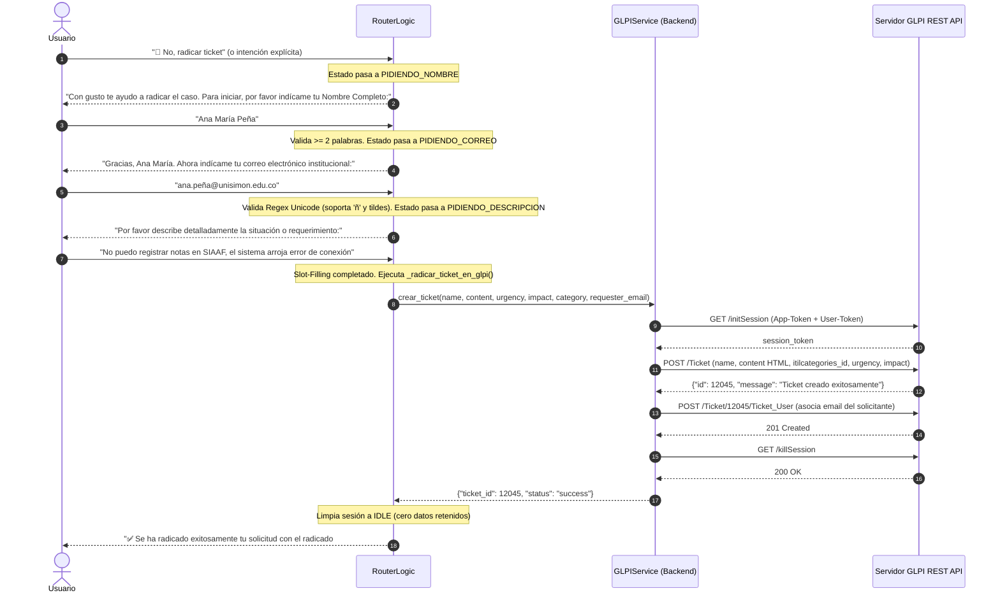

# Arquitectura y Flujo Integral de Procesamiento de UniMon

Este documento describe con máximo nivel de detalle técnico el ciclo de vida completo de un mensaje en el sistema **UniMon** (Universidad Simón Bolívar), desde que el usuario envía su consulta en la interfaz web hasta la entrega de la solución técnica, la actualización de la memoria rápida (Golden Cache) o la radicación formal de un ticket en GLPI.

---

## 1. Mapa de Componentes y Arquitectura del Sistema

```
┌────────────────────────────────────────────────────────────────────────────────────────┐
│                                 CAPA DE PRESENTACIÓN                                   │
│            Interfaz Web Interactiva (HTML5 / Vanilla CSS / Botones de Diagnóstico)     │
└───────────────────────────────────────────┬────────────────────────────────────────────┘
                                            │ HTTP POST /api/chat (JSON)
                                            ▼
┌────────────────────────────────────────────────────────────────────────────────────────┐
│                                  CAPA DE SERVICIOS API                                 │
│                   FastAPI (`app/routers/chat.py` & `app/routers/analytics.py`)         │
│  - Endpoint Chat: `POST /api/chat`             - Endpoint KPIs: `GET /api/analytics/kpis`│
│  - Clusters: `GET /api/analytics/clusters`     - DPO Export: `GET /api/analytics/export`│
└───────────────────────────────────────────┬────────────────────────────────────────────┘
                                            │ Invoca `RouterLogic.procesar_mensaje()`
                                            ▼
┌────────────────────────────────────────────────────────────────────────────────────────┐
│                        ORQUESTADOR DE DIÁLOGO Y MÁQUINA DE ESTADOS                     │
│                             `app/services/router_logic.py`                             │
│  - Gestión de Sesiones en Memoria (`TicketSession` con TTL de 30 min)                  │
│  - Regla Global 1: Flujo de Cancelación Universal (`is_cancellation`)                  │
│  - Regla Global 2: Cierre por Caso Solucionado (`is_solved_confirmation` -> Golden)    │
│  - Regla Global 3: Respuesta Instantánea para Directorio y Canales TI                  │
│  - Regla Global 4: Guardrail Estricto Fuera de Dominio (`is_out_of_domain_query`)      │
│  - Calificación de Rol con Botones (`PIDIENDO_ROL` + purga de contexto)                │
│  - Enrutamiento Rápido de Hardware / Soporte Físico (`classify_intent`)                │
│  - Diagnóstico Multinivel (Hasta 2 intentos antes de escalado automático)              │
│  - Slot-Filling Robusto (Nombre, Correo Unicode-aware, Descripción del caso)           │
└────────────┬──────────────────────────────┬─────────────────────────────┬──────────────┘
             │                              │                             │
    Memoria  │                 Consulta     │                   Radicación│
    Rápida   ▼                 RAG N1       ▼                   de Ticket ▼
┌──────────────────────────┐ ┌──────────────────────────┐ ┌──────────────────────────────┐
│       GOLDEN CACHE       │ │       MOTOR RAG N1       │ │   CLIENTE REST DE TICKETS    │
│ `golden_cache_service.py`│ │  `app/services/rag_service`│ │ `app/services/glpi_service.py` │
│                          │ │                          │ │                              │
│ • Colección ChromaDB:    │ │ 1. Expansión LLM/Léxica  │ │ 1. `initSession` (App+User)  │
│   `golden_resolved_qa`   │ │ 2. Filtro por Rol        │ │ 2. `POST /Ticket` (Categoría,│
│ • Hash SHA-256 Upsert    │ │ 3. ChromaDB (`BAAI/bge`) │ │    urgencia, impacto)        │
│ • Similitud Coseno >=0.90│ │    $k=8$, Score >= 0.48  │ │ 3. `POST /Ticket_User`       │
│ • Auto-invalidación ante │ │ 4. Cross-Encoder Reranker│ │    (Asocia correo usuario)   │
│   feedback negativo      │ │    Top-8 -> Top-3        │ │ 4. `killSession`             │
└──────────────────────────┘ └──────────────┬───────────┘ └──────────────────────────────┘
                                            │ Prompt Estricto
                                            ▼
                             ┌──────────────────────────┐
                             │     LLM LOCAL OLLAMA     │
                             │  Modelo: `unimon:8b`     │
                             │  (Llama 3.1 8B Fine-Tuned│
                             │   Temp: 0.0 - Top-P: 0.9)│
                             └──────────────┬───────────┘
                                            │ Post-Procesamiento
                                            ▼
                             ┌──────────────────────────┐
                             │ POST-PROCESADOR / GUARDS │
                             │ • Sanitizador de URLs    │
                             │   (`ALLOWED_DOMAINS`)    │
                             │ • Limpieza de GLPI/Fugas │
                             │ • Pie de Confirmación    │
                             └──────────────────────────┘
```

---

## 2. Diagrama de Flujo Integral del Procesamiento

```mermaid
flowchart TD
    Inicio([👤 Usuario envía mensaje]) --> RecibeAPI[🌐 FastAPI: POST /api/chat]
    RecibeAPI --> ObtenerSesion[Obtener / Inicializar TicketSession en memoria]

    %% REGLAS GLOBALES Y GUARDRAILS
    ObtenerSesion --> CheckCancel{¿Es cancelación?<br/>'no', 'cancelar', 'ya no'}
    CheckCancel -- Sí --> ResetCancel[Limpiar sesión a IDLE] --> RespCancel[Retornar: CANCELADO]
    
    CheckCancel -- No --> CheckSolved{¿Es confirmación de solución?<br/>'ya funcionó', 'ya pude', 'listo'}
    CheckSolved -- Sí --> SaveGoldenGlobal[Guardar caso en Golden Cache] --> ResetSolved[Limpiar sesión a IDLE] --> RespSolved[Retornar: SOLUCIONADO]

    CheckSolved -- No --> CheckDirectorio{¿Pide canales de atención o directorio?<br/>'wasap', 'correo soporte', 'canales'}
    CheckDirectorio -- Sí --> RespDirectorio[Retornar Directorio TI Inmediato<br/>Estado: DIAGNOSTICO]

    CheckDirectorio -- No --> CheckOOD{¿Consulta Fuera de Dominio?<br/>Código general, tareas, ensayos, cultura}
    CheckOOD -- Sí --> PurgeOOD[Purga pending_query y reset a IDLE] --> RespOOD[Retornar: FUERA_DE_DOMINIO<br/>quick_replies: empty]

    %% EVALUACIÓN DE ESTADOS CONVERSACIONALES
    CheckOOD -- No --> EvalEstado{Estado de la Sesión}

    %% ESTADO: PIDIENDO_ROL
    EvalEstado -- PIDIENDO_ROL --> ParseRol{¿Seleccionó o declaró Rol?<br/>Estudiante, Funcionario, Docente, Otros}
    ParseRol -- No identificado --> ReAskRol[Reiterar MENSAJE_PIDIENDO_ROL con ROLE_QUICK_REPLIES]
    ParseRol -- Identificado --> SetRol[Asignar user_role en sesión]
    SetRol --> CheckPendingOOD{¿pending_query era OOD?}
    CheckPendingOOD -- Sí --> PurgePending[pending_query = None] --> ReadyMsg[Retornar DIAGNOSTICO:<br/>'¿En qué te puedo colaborar hoy?']
    CheckPendingOOD -- No --> CheckPendingValida{¿Había pregunta técnica previa?}
    CheckPendingValida -- Sí --> CheckHardwareFastPending{¿Es falla física o hardware?}
    CheckHardwareFastPending -- Sí --> JumpNombreHW[Salto a PIDIENDO_NOMBRE]
    CheckHardwareFastPending -- No --> PipelineRAG
    CheckPendingValida -- No --> ReadyMsg

    %% ESTADO: IDLE
    EvalEstado -- IDLE --> CheckRolAsignado{¿Tiene user_role en sesión?}
    CheckRolAsignado -- No --> TryDetectRol{¿Menciona su rol en el mensaje?}
    TryDetectRol -- Sí --> SetRolDirecto[Asignar user_role] --> CheckEsSoloRol{¿Es solo declaración de rol o saludo?}
    CheckEsSoloRol -- Sí --> SaludoRol[Retornar SALUDO / DIAGNOSTICO]
    CheckEsSoloRol -- No --> CheckHardwareFastIDLE{¿Es falla física o hardware?}
    CheckHardwareFastIDLE -- Sí --> JumpNombreHW
    CheckHardwareFastIDLE -- No --> PipelineRAG
    TryDetectRol -- No --> RetenerPregunta[Guardar pregunta en pending_query] --> SetPidiendoRol[Estado: PIDIENDO_ROL] --> MsgPidiendoRol[Retornar MENSAJE_PIDIENDO_ROL + ROLE_QUICK_REPLIES]

    CheckRolAsignado -- Sí --> CheckHardwareFastKnown{¿Es falla física o hardware?}
    CheckHardwareFastKnown -- Sí --> JumpNombreHW
    CheckHardwareFastKnown -- No --> PipelineRAG

    %% ESTADO: DIAGNOSTICO
    EvalEstado -- DIAGNOSTICO --> CheckFeedbackDiagnostico{Feedback del usuario}
    CheckFeedbackDiagnostico -- RESOLVED ('Sí, me funcionó') --> SaveGoldenDiag[Guardar en Golden Cache] --> ResetDiagSolved[Limpiar a IDLE] --> RespSolved
    CheckFeedbackDiagnostico -- CREATE_TICKET ('No, radicar ticket') --> InvalidateGolden[Invalidar caso en Golden Cache] --> JumpNombre[Salto a PIDIENDO_NOMBRE]
    CheckFeedbackDiagnostico -- RETRY_DIAGNOSIS ('Intentar de nuevo') --> InvalidateGoldenRetry[Invalidar caso en Golden Cache] --> CheckIntentos{Intentos < 2}
    CheckIntentos -- Sí --> IncrIntento[Incrementar intento] --> PipelineRAG
    CheckIntentos -- No --> AutoEscalar[Escalado automático a Radicación] --> JumpNombre
    CheckFeedbackDiagnostico -- Texto Libre / Nueva Consulta --> PipelineRAG

    %% ESTADO: OFRECIENDO_RADICACION
    EvalEstado -- OFRECIENDO_RADICACION --> CheckAceptaOfrecimiento{¿Acepta radicar ticket?}
    CheckAceptaOfrecimiento -- Sí --> JumpNombre
    CheckAceptaOfrecimiento -- No / Nueva Pregunta --> PipelineRAG

    %% FLUIDO DE SLOT-FILLING
    EvalEstado -- PIDIENDO_NOMBRE --> ValidarNombre{Nombre válido?<br/>>= 2 palabras, sin stopwords}
    ValidarNombre -- No --> ReAskNombre[Solicitar nombre completo de nuevo]
    ValidarNombre -- Sí --> SaveNombre[Guardar session.nombre] --> NextCorreo[Estado: PIDIENDO_CORREO]

    EvalEstado -- PIDIENDO_CORREO --> ValidarCorreo{Email válido?<br/>Unicode-aware regex}
    ValidarCorreo -- No --> ReAskCorreo[Solicitar correo institucional válido]
    ValidarCorreo -- Sí --> SaveCorreo[Guardar session.correo] --> NextDesc[Estado: PIDIENDO_DESCRIPCION]

    EvalEstado -- PIDIENDO_DESCRIPCION --> SaveDesc[Guardar session.descripcion] --> CrearTicketGLPI[Ejecutar radicación en GLPI REST API]
    CrearTicketGLPI --> ResetSesionGLPI[Limpiar sesión a IDLE] --> RespTicketCreado[Retornar TICKET_CREADO #ID]

    %% PIPELINE RAG Y MOTOR DE GENERACIÓN
    subgraph PipelineRAG [Pipeline RAG Local & Inferencia]
        ConsultarGolden{1. ¿Existe coincidencia en Golden Cache?<br/>Score >= 0.90}
        ConsultarGolden -- Sí --> ServeGolden[Retornar Respuesta Golden Cache Inmediata]
        ConsultarGolden -- No --> QueryExpansion[2. Expansión LLM + Normalización Léxica]
        QueryExpansion --> BuildRoleFilter[3. Construir Filtro de Rol ChromaDB]
        BuildRoleFilter --> ChromaSearch[4. Búsqueda Vectorial k=8 con BAAI/bge-m3]
        ChromaSearch --> Reranker[5. Cross-Encoder Reranker: Top-8 -> Top-3<br/>- Penaliza Primer Semestre en estudiantes antiguos (-6.0)<br/>- Boost a Microsoft Password Reset (+4.0)]
        Reranker --> CheckMinScore{6. ¿Top chunk tiene Score >= 0.48?}
        CheckMinScore -- No --> FallbackNoDoc[Retornar MENSAJE_NO_DOCUMENTADO<br/>Estado: OFRECIENDO_RADICACION]
        CheckMinScore -- Sí --> AssembleStrictPrompt[7. Ensamblar Prompt Estricto N1 + Few-Shot + Contexto]
        AssembleStrictPrompt --> OllamaInference[8. Invocación Ollama unimon:8b Temp: 0.0]
        OllamaInference --> PostProcessing[9. Post-Procesador:<br/>- Sanitizador de URLs en lista blanca<br/>- Limpieza de GLPI y fugas<br/>- Inyección de Pie de Confirmación]
        PostProcessing --> RespDiagnosticoFinal[Retornar DIAGNOSTICO con Botones Rápidos]
    end
```

---

## 3. Desglose Fase por Fase del Proceso

### Fase 1: Recepción e Inicialización de Sesión
1. El usuario interactúa mediante la interfaz web (`app/static/index.html`).
2. Se envía una petición `POST /api/chat` con la siguiente estructura JSON:
   ```json
   {
     "mensaje": "Olvidé mi contraseña del portal estudiantil",
     "session_id": "usr_78a9bc12",
     "user_role": null
   }
   ```
3. El router de FastAPI (`app/routers/chat.py`) obtiene o crea una instancia de `TicketSession` en memoria.
4. La sesión cuenta con un **TTL de 30 minutos** de inactividad; si expira, se resetea automáticamente a `IDLE`.

---

### Fase 2: Reglas Globales y Guardrails Tempranos (Bypass Pre-RAG)
Antes de ejecutar operaciones pesadas de búsqueda vectorial o inferencia LLM, `RouterLogic.procesar_mensaje()` evalúa cuatro reglas globales deterministas:

1. **Regla Global 1 (Cancelación Universal):**
   - Si el usuario envía *"cancelar"*, *"no"*, *"ya no"* o *"olvídalo"* en estados de radicación, se resetea la sesión a `IDLE` y se emite `MENSAJE_CANCELACION`.
2. **Regla Global 2 (Cierre por Solución Confirmada):**
   - Si el usuario envía *"ya funcionó"*, *"ya pude ingresar"*, *"listo gracias"*, se emite la despedida institucional, se persiste el par `(query, response)` en el **Golden Cache** (`golden_resolved_qa`) y la sesión pasa a `IDLE`.
3. **Regla Global 3 (Directorio y Canales de Atención Directos):**
   - Consultas informativas como *"cuál es el whatsapp"*, *"canales de atención"*, *"correo soporte"* entregan de inmediato el directorio oficial de Barranquilla y Cúcuta sin alucinaciones.
4. **Regla Global 4 (Guardrail Estricto Fuera de Dominio):**
   - Se interceptan de forma inmediata temas ajenos al alcance de TI:
     * **Programación y Desarrollo General:** `"hola mundo"`, `"hazme un código"`, `"script en python"`, `"corrige mi código"`. *(Excepción: Solicitudes formales de desarrollo de software institucional para TI P-GT-13)*.
     * **Tareas e Investigaciones Académicas:** `"investigación de"`, `"resumen del libro"`, `"quién fue"`, `"hazme un ensayo"`, `"resuelve este ejercicio"`.
     * **Cultura General y Misceláneos:** Cocina, recetas, fútbol, política, chistes, poemas.
   - Retorna inmediatamente `tipo: "FUERA_DE_DOMINIO"`, `quick_replies: []` y resetea la sesión.

---

### Fase 3: Calificación de Rol y Purga de Contexto
- Si el usuario no tiene rol asignado en la sesión y no lo especifica en su mensaje:
  1. Su consulta se retiene temporalmente en `session.pending_query` (salvo si era un saludo o fuera de dominio).
  2. La sesión pasa a `EstadoTicket.PIDIENDO_ROL`.
  3. Se entrega `MENSAJE_PIDIENDO_ROL` junto con `ROLE_QUICK_REPLIES` (Estudiante, Administrativo / Funcionario, Profesor / Docente, Otros / Visitante).
- **Purga de Contexto:** Al recibir la selección de rol, si `session.pending_query` contenía una consulta fuera de dominio, se purga de inmediato (`session.pending_query = None`) para evitar que el sistema interprete consultas previas de código como "código estudiantil".

---

### Fase 4: Enrutamiento Rápido de Hardware / Soporte Físico
- Consultas sobre fallas físicas evidentes (ej. *"no enciende el pc de la sala 2"*, *"pantalla azul"*, *"cable de red dañado"*):
  - Son clasificadas por `classify_intent()` como `SOPORTE_FISICO`.
  - Omiten el RAG y pasan directamente a `EstadoTicket.PIDIENDO_NOMBRE` para agilizar la radicación del ticket en GLPI.

---

### Fase 5: Memoria Rápida Golden Cache (`golden_cache_service.py`)
1. Antes de ejecutar RAG, se consulta la colección ChromaDB `golden_resolved_qa`.
2. Si existe un caso idéntico o semánticamente equivalente con **Similitud Coseno $\ge 0.90$**:
   - Se entrega la respuesta golden optimizada de inmediato ($<50$ ms).
3. **Gestión Determinista:**
   - Cada entrada se almacena con un hash determinista: `sha256(f"{role}:{clean_query}")`.
   - Se utiliza `collection.upsert()` para prevenir duplicidad.
4. **Auto-Invalidación:**
   - Si el usuario presiona *"🎫 No, radicar ticket"* o *"🔄 Intentar de nuevo"*, la entrada correspondiente se elimina automáticamente de la memoria para evitar *cache poisoning*.

---

### Fase 6: Pipeline RAG y Motor de Generación
Si no hay coincidencia en Golden Cache, se ejecuta el pipeline RAG completo en `app/services/rag_service.py`:

```
┌────────────────────────────────────────────────────────┐
│ 1. Expansión LLM + Normalización Léxica                │
│    Traduce jerga a terminología técnica institucional. │
└─────────────────────────┬──────────────────────────────┘
                          │
                          ▼
┌────────────────────────────────────────────────────────┐
│ 2. Construcción de Filtro por Rol en ChromaDB          │
│    • Estudiante: Documentos de autoservicio y general. │
│    • Funcionario/Admin TI: Acceso a instructivos TI.   │
│    • Otros: Acceso irrestricto sin filtro.             │
└─────────────────────────┬──────────────────────────────┘
                          │
                          ▼
┌────────────────────────────────────────────────────────┐
│ 3. Búsqueda Vectorial por Similitud Semántica (k=8)    │
│    Modelo: `BAAI/bge-m3` (normalizado, local offline)  │
└─────────────────────────┬──────────────────────────────┘
                          │
                          ▼
┌────────────────────────────────────────────────────────┐
│ 4. Cross-Encoder / Heuristic Reranker (Top-8 -> Top-3) │
│    • Penalización (-6.0) a PDFs de "Primer Semestre"   │
│      si el usuario es estudiante antiguo / ordinal.    │
│    • Boost (+4.0) a recuperación de Microsoft.         │
│    • Priorización de rutas administrativas (P-GT).     │
└─────────────────────────┬──────────────────────────────┘
                          │
                          ▼
┌────────────────────────────────────────────────────────┐
│ 5. Control de Umbral de Relevancia (Score >= 0.48)     │
│    • Chunks >= 0.48: Pasan a construcción de contexto. │
│    • Chunks < 0.48: Fallback a MENSAJE_NO_DOCUMENTADO. │
└────────────────────────────────────────────────────────┘
```

---

### Fase 7: Ensamblaje del Prompt Estricto y Generación LLM
Se ensambla el payload enviado al LLM local Ollama (`unimon:8b` basado en Llama 3.1:8B) con **Temperature: 0.0** (estrictamente determinista):

#### Directivas del `STRICT_SYSTEM_PROMPT_TEMPLATE`:
1. **Clasificación y Tono:**
   - **Consultas Directas:** Respuestas breves y organizadas por sede.
   - **Dotación y Renovación de Puesto (PC):** Exige obligatoriamente el visto bueno/aval de la Jefatura de Dependencia y la justificación técnica.
   - **Préstamo de Audiovisuales:** Prohíbe autorizaciones automáticas y entrega la plantilla oficial de solicitud a TI.
2. **Priorización Obligatoria de Autoservicio:**
   - Si el trámite puede realizarse en línea (portal, contraseñas, certificados, SIAAF), es **obligatorio** detallar el paso a paso (Paso 1, Paso 2...). Prohibido enviar a soporte como primera opción.
3. **Jerarquía Estricta de Salida:**
   - `1. ⚠️ Requisitos y Restricciones Previas` (si aplican).
   - `2. Procedimiento Paso a Paso` (acciones cronológicas).
   - `3. Canales de Soporte / Escalado` (**siempre al final**, prohibido ubicarlos en el encabezado).
4. **Grounding y Fugas:** Cero meta-lenguaje ("según el PDF"), cero saludos repetitivos.

---

### Fase 8: Post-Procesamiento y Sanitización de Enlaces
Antes de retornar la respuesta al usuario, `clean_llm_response()` ejecuta:
1. **Sanitizador de URLs (`sanitize_markdown_links`):**
   - Compara cada enlace `[Texto](url)` contra `ALLOWED_DOMAINS_AND_URLS`.
   - Si la URL es inventada (ej. `https://unisimon.edu.co/activacion-de-cuenta`), se transforma a **texto plano** (`Texto`).
   - Si pertenece a los dominios oficiales (`portal.unisimon.edu.co`, `passwordreset.microsoftonline.com`, etc.), se preserva.
2. **Limpieza de GLPI:** Transforma placeholders falsos como `[URL del GLPI]` a *"la Mesa de Ayuda TI"*.
3. **Pie de Confirmación Único:** Ubica estrictamente al final la pregunta de feedback interactiva.

---

### Fase 9: Flujo de Slot-Filling y Radicación en GLPI REST API



---

### Fase 10: Telemetría, Clustering Semántico y Exportación DPO

El sistema registra métricas de desempeño y calidad de servicio en `data/analytics.db`:

1. **Telemetría Automática (`telemetry_service.py`):**
   - Registra cada interacción: `session_id`, `user_role`, `user_query`, `bot_response`, `source`, `response_type`, `resolution_status`, `turn_count`, `timestamp`.
2. **Clustering Semántico y Detección de Brechas (`GET /api/analytics/clusters`):**
   - Agrupa semánticamente las consultas de usuarios mediante embeddings vectoriales con **DBSCAN** y **K-Means**.
   - Calcula el ratio de resolución (`RESOLVED` vs. `RETRY`/`CREATE_TICKET`).
   - Identifica vacíos documentales (`requires_new_doc=True` cuando la tasa de resolución es $< 50\%$ en grupos de $\ge 2$ consultas).
3. **Exportador de Preferencias DPO (`GET /api/analytics/export-dpo-dataset`):**
   - Genera triplets de entrenamiento por preferencia `(prompt, chosen, rejected)` en formato **JSONL** (`application/x-ndjson`) a partir de interacciones resueltas satisfactoriamente (`chosen`) vs. respuestas que requirieron reintento o escalado (`rejected`).

---

## 4. Matriz de Estados de la Máquina de Diálogo (`EstadoTicket`)

| Estado | Evento de Entrada | Acción / Comportamiento | Siguiente Estado |
|---|---|---|---|
| `IDLE` | Mensaje inicial sin rol | Guarda `pending_query`, emite `MENSAJE_PIDIENDO_ROL` | `PIDIENDO_ROL` |
| `IDLE` | Mensaje inicial con rol | Asigna `user_role`, evalúa Hardware Fast Path o RAG | `DIAGNOSTICO` o `PIDIENDO_NOMBRE` |
| `PIDIENDO_ROL` | Selección de rol en botón o texto | Asigna rol, purga OOD de `pending_query`, procesa consulta en RAG | `DIAGNOSTICO` u `OFRECIENDO_RADICACION` |
| `DIAGNOSTICO` | Click `RESOLVED` ("✅ Sí, me funcionó") | Guarda en Golden Cache, emite despedida | `IDLE` |
| `DIAGNOSTICO` | Click `CREATE_TICKET` ("🎫 No, radicar ticket") | Invalida Golden Cache, inicia Slot-Filling | `PIDIENDO_NOMBRE` |
| `DIAGNOSTICO` | Click `RETRY_DIAGNOSIS` ("🔄 Intentar de nuevo") | Invalida Golden Cache, reintenta (hasta 2 veces) | `DIAGNOSTICO` (o `PIDIENDO_NOMBRE` si supera máx) |
| `DIAGNOSTICO` | Falla física / Hardware directo | Enrutamiento semántico directo sin RAG | `PIDIENDO_NOMBRE` |
| `OFRECIENDO_RADICACION` | Aceptación ("sí", "radicar") | Inicia Slot-Filling directo | `PIDIENDO_NOMBRE` |
| `OFRECIENDO_RADICACION` | Rechazo ("no", "cancelar") | Emite mensaje de cancelación | `IDLE` |
| `PIDIENDO_NOMBRE` | Nombre completo ($\ge 2$ palabras válidas) | Guarda `session.nombre` | `PIDIENDO_CORREO` |
| `PIDIENDO_CORREO` | Email válido (Unicode regex) | Guarda `session.correo` | `PIDIENDO_DESCRIPCION` |
| `PIDIENDO_DESCRIPCION` | Descripción del requerimiento | Radica ticket en GLPI, limpia sesión | `IDLE` |

---

## 5. Parámetros Técnicos y Constantes de Configuración

| Parámetro | Valor | Componente | Propósito |
|---|---|---|---|
| **Modelo LLM** | `unimon:8b` (Llama 3.1:8B) | Ollama Local | Inferencia y redacción técnica N1 |
| **Temperature** | `0.0` | Ollama / RAG | Generación determinista sin variabilidad |
| **Top-P** | `0.90` | Ollama / RAG | Nucleus sampling enfocado |
| **Repeat Penalty** | `1.15` | Ollama / RAG | Prevención de loops de repetición |
| **Modelo Embeddings** | `BAAI/bge-m3` | HuggingFace / ChromaDB | Embeddings multilingües densos/sparse |
| **Recuperación Chunks** | $k=8$ inicial $\rightarrow$ Top-3 | RAG / Reranker | Reranking con penalizaciones semánticas |
| **Umbral Mínimo Score** | $\ge 0.48$ | RAG Service | Corte estricto anti-alucinaciones |
| **Umbral Golden Cache** | $\ge 0.90$ (Similitud Coseno) | Golden Cache | Reutilización determinista de soluciones |
| **Máx Intentos Diagnóstico**| `2` | Router Logic | Escalado automático a ticket |
| **TTL de Sesión** | `1800` segundos (30 min) | Router Logic | Expiración y liberación de memoria |
