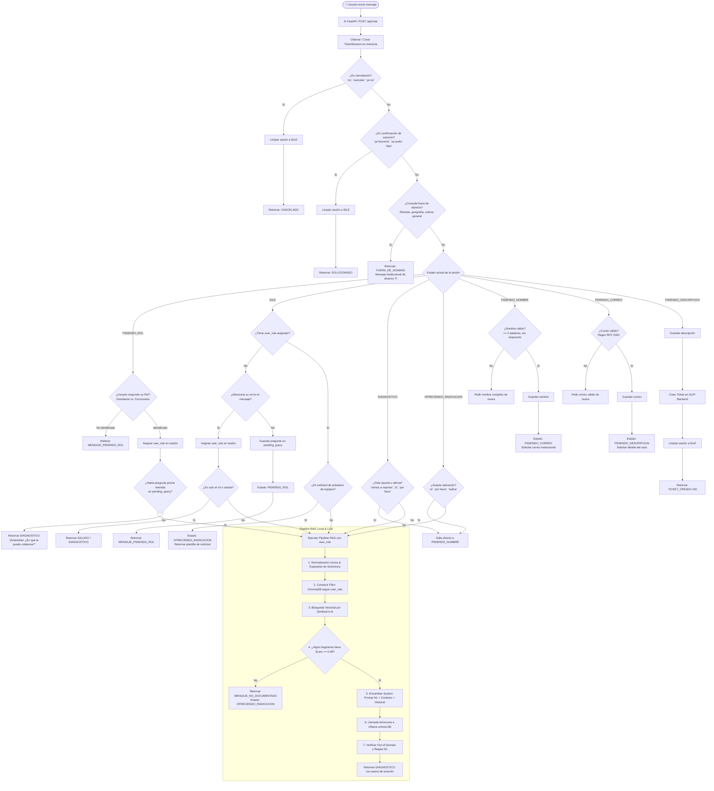
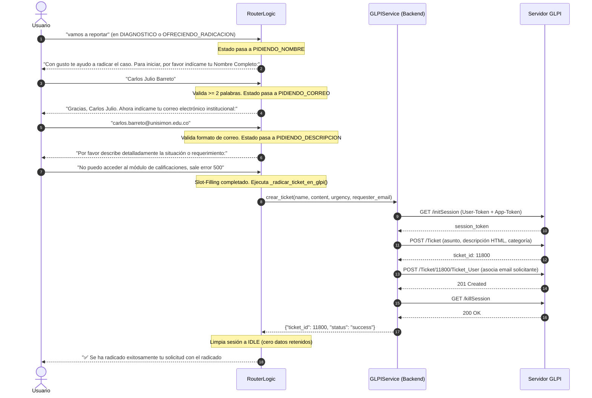

# Arquitectura y Flujo Integral de Procesamiento de UniMon

Este documento describe con máximo nivel de detalle el ciclo de vida completo de un mensaje en el sistema **UniMon** (Universidad Simón Bolívar), desde que el usuario envía su pregunta en la interfaz web hasta la entrega de la solución técnica o la radicación de la solicitud de soporte.

---

## 1. Mapa de Componentes del Sistema

```
┌────────────────────────────────────────────────────────────────────────────────────────┐
│                                 CAPA DE PRESENTACIÓN                                   │
│                        Interfaz Web Interactiva (HTML5 / Vanilla CSS)                   │
└───────────────────────────────────────────┬────────────────────────────────────────────┘
                                            │ HTTP POST /api/chat (JSON)
                                            ▼
┌────────────────────────────────────────────────────────────────────────────────────────┐
│                                  CAPA DE SERVICIOS API                                 │
│                   FastAPI Router (`app/routers/chat.py` & `app/main.py`)                │
└───────────────────────────────────────────┬────────────────────────────────────────────┘
                                            │ Invoca `procesar_mensaje()`
                                            ▼
┌────────────────────────────────────────────────────────────────────────────────────────┐
│                        ORQUESTADOR DE DIÁLOGO Y MÁQUINA DE ESTADOS                     │
│                             `app/services/router_logic.py`                             │
│  - Control de Sesiones (`TicketSession`)   - Guardrails Fuera de Dominio               │
│  - Calificación de Rol (`PIDIENDO_ROL`)     - Slot-Filling (Nombre, Correo, Detalle)    │
│  - Detección de Intenciones y Cierres      - Detección de Reporte / Escalado           │
└─────────────────────┬─────────────────────────────────────────────┬────────────────────┘
                      │                                             │
      Flujo Consulta  │                                             │ Flujo Radicación
      Técnica / RAG   ▼                                             ▼
┌───────────────────────────────────────────┐     ┌──────────────────────────────────────┐
│        MOTOR RAG Y BASE VECTORIAL         │     │         CLIENTE REST DE TICKETS      │
│       `app/services/rag_service.py`       │     │     `app/services/glpi_service.py`   │
│                                           │     │                                      │
│  1. Expansión Léxica (`normalizer_service`)│     │  1. `initSession`                    │
│  2. Filtro por Taxonomía (`doc_type`/`aud`)│     │  2. `POST /Ticket`                   │
│  3. ChromaDB Embeddings ($k=6$, Score 0.48)│     │  3. `POST /Ticket_User`              │
│  4. System Prompt Estricto N1             │     │  4. `killSession`                    │
└─────────────────────┬─────────────────────┘     └──────────────────────────────────────┘
                      │ Payload Prompt
                      ▼
┌───────────────────────────────────────────┐
│              LLM LOCAL OLLAMA             │
│    Modelo Especializado `unimon:8b`       │
│     (Llama 3.1:8B - Temp: 0.1, Top-P: 0.9)│
└───────────────────────────────────────────┘
```

---

## 2. Diagrama de Flujo General del Procesamiento



---

## 3. Desglose Fase por Fase del Proceso

### Fase 1: Recepción de la Petición HTTP
1. El usuario interactúa a través de `app/static/index.html`.
2. Se envía una petición `POST /api/chat` con el siguiente cuerpo JSON:
   ```json
   {
     "mensaje": "¿Cómo solicito los reportes de desertores?",
     "session_id": "usr_98a72b1c",
     "user_role": null
   }
   ```
3. El router de FastAPI (`app/routers/chat.py`) recupera o inicializa la sesión en memoria mediante `RouterLogic.get_session(session_id)`.

---

### Fase 2: Filtros de Control Global y Calificación de Rol (`PIDIENDO_ROL`)

Antes de realizar cualquier operación costosa (búsqueda vectorial o inferencia con Ollama), el sistema evalúa:

1. **Cancelación Universal (`CANCEL_PATTERNS`):**
   - Si el usuario dice *"cancelar"*, *"ya no"*, *"no"* o *"olvídalo"*, la sesión se restablece inmediatamente a `IDLE` sin llamar al LLM.
2. **Cierre por Caso Resuelto (`SOLVED_PATTERNS`):**
   - Si el usuario escribe *"ya funcionó"*, *"ya pude entrar"* o *"listo"*, se entrega la despedida institucional y la sesión pasa a `IDLE`.
3. **Guardrail Rápido Fuera de Dominio (`is_out_of_domain_query`):**
   - Preguntas sobre recetas, geografía o cultura general son interceptadas en $<1$ ms, retornando un mensaje delimitador de dominio institucional.
4. **Calificación Obligatoria de Perfil:**
   - Si `session.user_role` es `None` y el usuario no incluyó su rol en el mensaje:
     - La pregunta se almacena temporalmente en `session.pending_query`.
     - La sesión pasa a `EstadoTicket.PIDIENDO_ROL`.
     - Se responde solicitando el perfil:
       > *"¡Hola! 👋 Soy UniMon, el Asistente Virtual Oficial de TI de la Universidad Simón Bolívar. Para brindarte la información exacta y los instructivos correctos correspondientes a tu perfil: ¿Eres Estudiante o Funcionario / Docente?"*
   - Cuando el usuario responde *"Soy funcionario"*:
     - Se establece `session.user_role = "funcionario"`.
     - Se recupera automáticamente `session.pending_query` y se envía al pipeline RAG con los privilegios de funcionario.

---

### Fase 3: Procesamiento en el Motor RAG Local

```
  Pregunta del Usuario
          │
          ▼
┌────────────────────────────────────────────────────────┐
│ 1. Normalizador Léxico y Expansor de Sinónimos         │
│    Ejemplo: "no me coge la clave en tims"               │
│    Resultado: "el usuario no puede autenticarse..."    │
└─────────────────────────┬──────────────────────────────┘
                          │
                          ▼
┌────────────────────────────────────────────────────────┐
│ 2. Aplicación de Filtro Booleano en ChromaDB           │
│    • Si user_role == 'estudiante':                     │
│      {"$and": [{"doc_type": "autoservicio"}, ...]}     │
│    • Si user_role == 'funcionario':                    │
│      {"audience": {"$in": ["general", "funcionario"]}}│
└─────────────────────────┬──────────────────────────────┘
                          │
                          ▼
┌────────────────────────────────────────────────────────┐
│ 3. Búsqueda Vectorial por Similitud Semántica (k=6)    │
│    Embeddings: `intfloat/multilingual-e5-base`         │
│    Colección: `langchain` (5.250 fragmentos)           │
└─────────────────────────┬──────────────────────────────┘
                          │
                          ▼
┌────────────────────────────────────────────────────────┐
│ 4. Calibración de Umbral de Relevancia (Score >= 0.48) │
│    • Chunks >= 0.48: Pasan al contexto del prompt.    │
│    • Chunks < 0.48: Descartados por baja similitud.   │
└────────────────────────────────────────────────────────┘
```

---

### Fase 4: Ensamblaje del Prompt y Generación con Llama 3.1

Si se recuperaron fragmentos válidos, se estructura el payload que se envía a Ollama:

#### Estructura del Prompt Inyectado:
```
[ROL: SYSTEM]
Eres UniMon, el Agente Oficial de Soporte Técnico N1 de la Universidad Simón Bolívar.

REGLAS DE ORO OBLIGATORIAS:
1. PROHIBICIÓN TOTAL DE REFERENCIAR MANUALES AL USUARIO: NUNCA le digas al usuario "revisa el instructivo", "consulta el PDF" o "dirígete a la presentación". Extrae los pasos del contexto y redacta la solución directa en tu mensaje.
2. GUÍA ACCIONABLE PASO A PASO: Explica con claridad qué debe hacer el usuario (Paso 1: Entra a [URL], Paso 2: Haz clic en [Botón], Paso 3: Diligencia [Campo]).
3. Si el contexto menciona una opción (como "Mis bloqueos" o "Recuperar contraseña"), indícale exactamente dónde hacer clic.
4. Finaliza siempre preguntando:
   "¿Te sirvieron estos pasos o prefieres que radique un caso de soporte técnico por ti?"
5. Si el contexto NO contiene los pasos de solución, responde únicamente con la plantilla estándar de no documentado.

Contexto institucional provisto:
[Reporte_Desertores.pdf (Pág. 3)]
Paso 1: Ingrese al módulo SIAAF Directores con sus credenciales institucionales.
Paso 2: En el menú lateral, seleccione Reportes Académicos -> Reporte de Desertores.
Paso 3: Seleccione el periodo lectivo y presione "Generar reporte en Excel".

Pregunta del usuario: ¿Cómo solicito los reportes de desertores?
Respuesta directa de soporte:

[ROL: USER]
[Rol del usuario: funcionario] Consulta del usuario: ¿Cómo solicito los reportes de desertores?
```

#### Invocación a Ollama (`POST /api/chat` en `http://localhost:11434`):
- **Modelo:** `unimon:8b`
- **Temperature:** `0.1` (Respuestas determinísticas y estrictas)
- **Top_P:** `0.9`
- **Repeat Penalty:** `1.15`

---

### Fase 5: Flujo de Radicación Automática de Tickets (Slot-Filling)

Cuando el usuario solicita reportar o indica que la falla persiste:



---

## 4. Matriz de Estados de la Máquina de Estados (`EstadoTicket`)

| Estado | Evento de Entrada | Acción / Comportamiento | Siguiente Estado |
|---|---|---|---|
| `IDLE` | Mensaje nuevo sin rol | Guarda `pending_query`, emite `MENSAJE_PIDIENDO_ROL` | `PIDIENDO_ROL` |
| `IDLE` | Mensaje nuevo con rol | Asigna `user_role`, ejecuta RAG | `DIAGNOSTICO` |
| `PIDIENDO_ROL` | "Soy estudiante" / "Soy funcionario" | Asigna rol, procesa `pending_query` en RAG | `DIAGNOSTICO` u `OFRECIENDO_RADICACION` |
| `DIAGNOSTICO` | Nueva duda técnica / síntomas | Ejecuta RAG con contexto e historial (ilimitado) | `DIAGNOSTICO` |
| `DIAGNOSTICO` | Intención de reporte ("radicar", "sí") | Inicia Slot-Filling directo | `PIDIENDO_NOMBRE` |
| `OFRECIENDO_RADICACION` | Aceptación ("sí", "por favor") | Inicia Slot-Filling directo | `PIDIENDO_NOMBRE` |
| `OFRECIENDO_RADICACION` | Rechazo ("no", "cancelar") | Emite mensaje de cancelación | `IDLE` |
| `PIDIENDO_NOMBRE` | Nombre completo válido | Guarda `session.nombre` | `PIDIENDO_CORREO` |
| `PIDIENDO_CORREO` | Email institucional válido | Guarda `session.correo` | `PIDIENDO_DESCRIPCION` |
| `PIDIENDO_DESCRIPCION` | Texto del problema | Radica ticket en GLPI y limpia sesión | `IDLE` |
